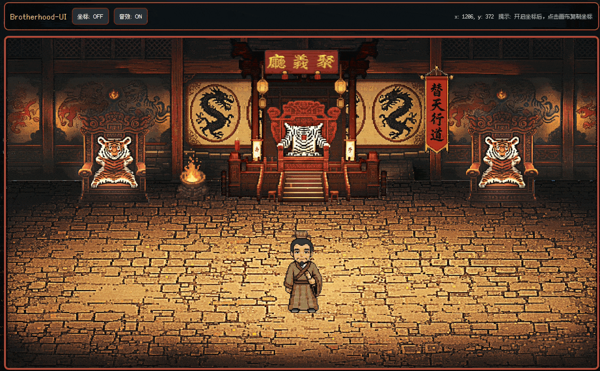

<div align="center">
  
  <h1>Brotherhood-UI</h1>
  <p><strong>Turn OpenClaw into a live Liangshan stage.</strong></p>
  <p>
    <a href="https://github.com/haihao0307/Brotherhood-UI"></a>
    <a href="./LICENSE"></a>
    
    
    
    
    
    
    
  </p>
  
</div>

**Languages:** [English](#english) | [繁體中文](#繁體中文)

---


> Best current flow: on Windows, open `Brotherhood-UI Launcher` and click `Start`; on macOS, run `python3 brotherhood_ui_launcher.py` and click `Start`.

### Demo Slots

Replace the GIF files in `docs/media/` with the same filenames and the README will update automatically on GitHub.

<p align="center">
  
</p>
<p align="center">
  
  
  
</p>


## English

### Turn OpenClaw into a live Liangshan stage.

Brotherhood-UI turns OpenClaw's natural-language workflow into a live pixel-art stage inspired by *Water Margin*.

> This is not just a status board. It is a visual performance layer for AI workflow.

Originally based on [ringhyacinth/Star-Office-UI](https://github.com/ringhyacinth/Star-Office-UI), this project has evolved far beyond a theme reskin.  
Its current goal is to map the user's conversation with OpenClaw into a real-time Liangshan-themed UI, where different task phases are handled by different heroes, and each state is expressed through animation, positioning, scene layering, props, and music. The result is a board that lets users instantly understand whether OpenClaw is researching, writing, executing, syncing, or recovering from errors, even without reading logs.

### Core Idea

- Natural language in, Liangshan performance out
- Different task phases are handled by different heroes
- The UI communicates state through animation, position, props, and music, not text alone

### Project Positioning

This project focuses on the full pipeline:

```text
OpenClaw natural-language task -> task routing -> hero/scene mapping -> real-time UI performance
```

In one sentence:

> Turn OpenClaw's internal state into something users can see and understand instantly.

### Current State Mapping

| State | Hero | Meaning |
| --- | --- | --- |
| `idle` | Song Jiang | Waiting, paused, or returned to standby after completion |
| `writing` | Wu Yong | Writing docs, prompts, copy, or structured text |
| `researching` | Song Jiang | Researching docs, references, and solution directions |
| `executing` | Wu Song | Coding, implementing, running commands, making changes |
| `syncing` | Lin Chong | Syncing, uploading, integrating, delivering |
| `error` | Lu Zhishen | Errors, failures, incidents, emergency recovery |

### What Makes This Project Different

- Natural-language driven routing instead of command-only control
- Hero-based stage mapping rather than a single character for every state
- Live animated performance with movement, state transitions, layering, and audio
- Theme-driven frontend powered by `frontend/themes/liangshan/theme.json`
- Built for OpenClaw workflow through `route_task.py` and `task_board.py`
- Designed to evolve from rule-based routing into stronger intent understanding

### Core Pipeline

```text
User natural language
  -> route_task.py / docs/task-routing-rules.md
  -> routed state and hero
  -> task_board.py / state.json
  -> backend/app.py
  -> frontend/js/theme-engine.js
  -> hero animation + props + music
```

### Why This Version Matters

- One-click launcher flow on Windows and a direct GUI launcher command on macOS
- Automatic local OpenClaw session mirroring through `openclaw_session_watch.py`
- 6-state hero performance model instead of a single character doing everything
- Natural-language routing expanded for real desktop operations on Windows and macOS
- Asset pipeline and `theme.json` workflow tuned for fast scene iteration

### What The Router Already Understands

- Coding work: frontend, backend, scripts, testing, build, deployment
- Desktop operations: move, copy, rename, delete, unzip, install, Finder, Explorer
- Browser work: upload, download, forms, login, tabs, refresh
- Office work: Word, Excel, PPT, PDF, print, scan
- System actions: Wi-Fi, Bluetooth, VPN, screenshots, terminal, permissions
- Failure cases: permission denied, file in use, damaged archive, upload failure, page freeze

### Key Differences From the Original Project

- Single `liangshan` theme only
- Shifted from “pixel office status board” to “Liangshan workflow performance board”
- Added `route_task.py` and `docs/task-routing-rules.md` for natural-language routing
- Added `task_board.py` for continuous task lifecycle synchronization
- `theme.json` is now the central scene configuration entry
- Added `sync_agent_theme.py` for asset workflow

### Recommended Start (Windows)

Install dependencies once:

```powershell
python -m pip install -r backend/requirements.txt
```

Create desktop shortcuts once:

```powershell
.\Create Desktop Shortcuts.bat
```

Then use the launcher:

```powershell
.\Brotherhood-UI Launcher.bat
```

Recommended test:

1. Run `.\Create Desktop Shortcuts.bat` once
2. Double-click `Brotherhood-UI Launcher` on your desktop
3. Click `Start`
4. Keep your local OpenClaw web chat open
5. Send a normal task such as `Help me inspect the OpenClaw docs structure`
6. Watch Brotherhood-UI switch through heroes and states automatically

Launcher buttons:

- `Start`: start backend, start OpenClaw sync, and open the board
- `Check`: verify backend health, watcher heartbeat, and session discovery
- `Open Board`: reopen the UI page without restarting services
- `Stop`: stop helper-managed backend and watcher

### Recommended Start (macOS)

Install dependencies once:

```bash
python3 -m pip install -r backend/requirements.txt
```

Then launch the GUI directly from Terminal:

```bash
python3 brotherhood_ui_launcher.py
```

Recommended test:

1. Open Terminal
2. `cd` into the project folder
3. Run `python3 brotherhood_ui_launcher.py`
4. Click `Start`
5. Keep your local OpenClaw web chat open
6. Send a normal task such as `Help me inspect the OpenClaw docs structure`
7. Watch Brotherhood-UI switch through heroes and states automatically

### Manual / Dev Start

Install dependencies:

```bash
python -m pip install -r backend/requirements.txt
```

Start the backend:

```bash
python backend/app.py
```

On macOS/Linux you can use the shell helper:

```bash
./brotherhood-ui.sh auto
./brotherhood-ui.sh doctor
./brotherhood-ui.sh stop
```

Default backend URL:

```text
http://127.0.0.1:18791
```

On some Windows setups the reachable local address may be another LAN address printed by Flask.  
If you use the launcher or helper scripts, they will try to open the reachable board address automatically.

Manual state test:

```bash
python set_state.py idle "Standby"
python set_state.py writing "Wu Yong is writing"
python set_state.py researching "Song Jiang is researching"
python set_state.py executing "Wu Song is implementing"
python set_state.py syncing "Lin Chong is syncing"
python set_state.py error "Lu Zhishen is handling an error"
```

### Drive the UI With Natural Language

Task routing only:

```powershell
python route_task.py "Help me change the homepage button color and implement it"
python route_task.py "Help me inspect the OpenClaw docs structure"
python route_task.py "Sync the local progress to the remote board"
```

Apply the routed result directly:

```powershell
python route_task.py "Help me change the homepage button color and implement it" --apply
```

Drive the full task lifecycle:

```powershell
python task_board.py start "Help me inspect the OpenClaw docs structure"
python task_board.py step executing "Wu Song is implementing the task"
python task_board.py done "Task completed, back to standby"
```

OpenClaw bridge:

```powershell
python openclaw_bridge.py start "Help me inspect the OpenClaw docs structure"
python openclaw_bridge.py phase "Reading the OpenClaw docs and organizing the plan"
python openclaw_bridge.py phase "Implementing the frontend mapping logic"
python openclaw_bridge.py done "Task completed, back to standby"
```

Windows helper:

```powershell
.\brotherhood-ui.bat serve
.\brotherhood-ui.bat watch
.\brotherhood-ui.bat open
.\brotherhood-ui.bat start "Help me inspect the OpenClaw docs structure"
.\brotherhood-ui.bat phase "Reading the OpenClaw docs and organizing the plan"
.\brotherhood-ui.bat phase "Implementing the frontend mapping logic" --state executing
.\brotherhood-ui.bat done "Task completed, back to standby"
```

CLI alternative for automatic local OpenClaw sync:

```powershell
.\brotherhood-ui.bat auto
```

Health check:

```powershell
.\brotherhood-ui.bat doctor
```

Stop helper-managed services:

```powershell
.\brotherhood-ui.bat stop
```

Recommended flow:

1. Open `Brotherhood-UI Launcher`
2. Click `Start`
3. Open or keep using your local OpenClaw web chat
4. Send a task to OpenClaw normally
5. Let `openclaw_session_watch.py` mirror the active local session into Brotherhood-UI

### Theme System

Theme directory:

```text
frontend/themes/liangshan/
```

Key configuration nodes:

- `mainHero`
- `supportHeroes`
- `slots`
- `stateScenes`
- `objects`

Most visual changes can be made by replacing assets and editing `theme.json` without rewriting frontend logic.

### OpenClaw Integration

- `openclaw_session_watch.py` watches the active local OpenClaw session and mirrors it into `state.json`
- `Brotherhood-UI Launcher.bat` is the recommended first-run entrypoint on Windows
- `python3 brotherhood_ui_launcher.py` is the recommended first-run entrypoint on macOS
- `brotherhood-ui.bat doctor` checks backend health, watcher heartbeat, and OpenClaw session discovery
- `brotherhood-ui.sh doctor` provides the same check flow on macOS/Linux
- `openclaw_bridge.py` remains available when you want to inject lifecycle events manually
- Integration notes live in `docs/openclaw-integration.md`

### Release Automation

- Push to `main` automatically creates a new GitHub Release
- Release tags use the format `auto-YYYYMMDD-HHMMSS-<short_sha>`
- GitHub generates release notes automatically from the pushed changes

### Asset Sync Tool

GUI mode:

```powershell
python sync_agent_theme.py --gui
```

CLI examples:

```powershell
python sync_agent_theme.py --input frontend/themes/liangshan/wusong_idle.gif
python sync_agent_theme.py --input E:\your-frames-folder --output E:\output\wusong_idle-spritesheet.png
python sync_agent_theme.py --input frontend/themes/liangshan/wuyong_writing-spritesheet.png --frame-count 9 --frame-rate 4 --sync --theme-json frontend/themes/liangshan/theme.json --target-kind support --hero-id wuyong --state-key writing
```

### Backend Endpoints

- `GET /`
- `GET /status`
- `POST /set_state`
- `GET /yesterday-memo`
- `POST /join-agent`
- `POST /agent-push`
- `GET /agents`

### Repository Structure

```text
Brotherhood-UI/
  backend/
  docs/
    openclaw-integration.md
    task-routing-rules.md
  frontend/
    css/
    js/
    themes/
      liangshan/
        theme.json
        props/
        audio/
  Brotherhood-UI Launcher.bat
  Create Desktop Shortcuts.bat
  brotherhood-ui.bat
  brotherhood-ui.ps1
  brotherhood-ui.sh
  brotherhood_ui_launcher.py
  create_desktop_shortcuts.ps1
  create_logo_icon.py
  openclaw_bridge.py
  openclaw_session_watch.py
  openclaw_sync_doctor.py
  route_task.py
  task_board.py
  set_state.py
  sync_agent_theme.py
  office-agent-push.py
```

### Good Fit For

- OpenClaw state visualization
- AI workflow observability
- Agent dashboards and desktop assistants
- Stylized UI projects instead of generic admin panels

### Roadmap

- Stronger natural-language routing beyond keyword rules
- Finer task-state modeling and a more stable state machine
- More complete Liangshan character asset replacement
- Richer props, music, and event performance
- Deeper automatic integration with OpenClaw

---

## 繁體中文

### Turn OpenClaw into a live Liangshan stage.

把 OpenClaw 的自然語言任務過程，即時翻譯成一塊會「演戲」的梁山像素看板。

> 這不只是狀態展示，而是把 AI 的工作流程變成使用者看得懂、聽得到、感受得到的現場演出。

Brotherhood-UI 基於 [ringhyacinth/Star-Office-UI](https://github.com/ringhyacinth/Star-Office-UI) 二次開發，但現在已經不是單純的換皮專案。  
它目前的目標，是把使用者與 OpenClaw 的自然語言互動，映射成一套可即時感知的梁山主題 UI：不同任務階段由不同英雄接手，不同狀態對應不同動畫、站位、場景層次、道具與音樂，讓使用者即使不看日誌，也能直觀知道 AI 現在是在查資料、寫內容、動手執行、同步協作，還是在緊急救火。

### 核心表達

- 自然語言進，梁山演出出
- 不同任務狀態，對應不同英雄接手
- UI 不只顯示文字，而是用動畫、站位、道具、音樂一起傳達狀態

### 專案定位

這個專案要解決的是：

```text
OpenClaw 自然語言任務 -> 狀態路由 -> 英雄/場景映射 -> 前端即時演出
```

一句話概括：

> 讓 OpenClaw 的內部狀態，變成使用者可以一眼看懂的「梁山現場」。

### 目前演出映射

| 狀態 | 英雄 | 含義 |
| --- | --- | --- |
| `idle` | 宋江 | 待命、暫停、任務完成後回堂前 |
| `writing` | 吳用 | 寫文案、寫說明、整理文件、寫提示詞 |
| `researching` | 宋江 | 查資料、看文件、做調研、分析方案 |
| `executing` | 武松 | 改程式、做頁面、跑命令、真正落地 |
| `syncing` | 林沖 | 同步、上傳、聯調、版本流轉、交付 |
| `error` | 魯智深 | 報錯、失敗、線上事故、緊急救火 |

### 這個專案最特別的地方

- 自然語言驅動：使用者原話不需要先轉成固定命令
- 梁山角色映射：不同任務階段由不同英雄出場
- 動態演出：人物會移動、切換狀態動畫、切換場景層次與音效
- 配置驅動主題：前端主場景由 `frontend/themes/liangshan/theme.json` 驅動
- 面向 OpenClaw 工作流：提供 `route_task.py` 與 `task_board.py`
- 可持續擴充：後續可以從關鍵字規則升級到更強的意圖辨識

### 核心鏈路

```text
使用者自然語言
  -> route_task.py / docs/task-routing-rules.md
  -> 狀態與英雄
  -> task_board.py / state.json
  -> backend/app.py
  -> frontend/js/theme-engine.js
  -> 梁山角色動畫 + 場景道具 + 音樂
```

### 這個版本的重點

- Windows 提供單一 Launcher；macOS 則可直接用 `python3 brotherhood_ui_launcher.py` 打開 GUI
- 可透過 `openclaw_session_watch.py` 自動鏡像本機 OpenClaw 會話
- 6 種狀態各自交給不同英雄，不再靠單一角色硬撐全部流程
- 關鍵字路由已擴充到大量桌面端口語操作
- `theme.json` 與素材同步工具的迭代流程更順

### 路由目前已覆蓋的常見任務

- 開發工作：前端、後端、腳本、自動化、測試、打包、部署
- 桌面操作：搬檔、複製、改名、刪除、解壓、安裝、Finder、資源管理器
- 瀏覽器操作：上傳、下載、表單、登入、分頁、刷新
- 辦公文件：Word、Excel、PPT、PDF、列印、掃描
- 系統操作：Wi-Fi、藍牙、VPN、截圖、終端、權限設定
- 異常場景：權限不足、檔案占用、壓縮包損壞、上傳失敗、頁面卡死

### 與原專案的主要差異

- 只保留 `liangshan` 單一主題
- 視覺表達從「辦公室狀態面板」轉向「梁山任務演出面板」
- 新增 `route_task.py` 與 `docs/task-routing-rules.md`
- 新增 `task_board.py` 以持續推送任務生命週期
- `theme.json` 已成為場景核心配置入口
- 新增素材同步工具 `sync_agent_theme.py`

### 推薦啟動方式（Windows）

先安裝依賴一次：

```powershell
python -m pip install -r backend/requirements.txt
```

先建立桌面快捷方式一次：

```powershell
.\Create Desktop Shortcuts.bat
```

之後直接用 Launcher：

```powershell
.\Brotherhood-UI Launcher.bat
```

推薦測試流程：

1. 先執行一次 `.\Create Desktop Shortcuts.bat`
2. 在桌面雙擊 `Brotherhood-UI Launcher`
3. 點擊 `Start`
4. 保持本機 OpenClaw 聊天頁開著
5. 正常送出一條任務
6. 觀察 Brotherhood-UI 是否自動切換英雄與狀態

Launcher 按鈕說明：

- `Start`：啟動後端、啟動 OpenClaw 同步、打開面板
- `Check`：檢查後端、watcher heartbeat 與會話發現
- `Open Board`：只重新打開 UI 頁面
- `Stop`：停止整個系統

### 推薦啟動方式（macOS）

先安裝依賴一次：

```bash
python3 -m pip install -r backend/requirements.txt
```

然後直接在 Terminal 執行 GUI：

```bash
python3 brotherhood_ui_launcher.py
```

推薦測試流程：

1. 打開 Terminal
2. `cd` 到專案目錄
3. 執行 `python3 brotherhood_ui_launcher.py`
4. 點擊 `Start`
5. 保持本機 OpenClaw 聊天頁開著
6. 正常送出一條任務
7. 觀察 Brotherhood-UI 是否自動切換英雄與狀態

### 手動 / 開發模式

安裝依賴：

```bash
python -m pip install -r backend/requirements.txt
```

啟動後端：

```bash
python backend/app.py
```

在 macOS / Linux 上也可以直接用 shell helper：

```bash
./brotherhood-ui.sh auto
./brotherhood-ui.sh doctor
./brotherhood-ui.sh stop
```

預設後端位址：

```text
http://127.0.0.1:18791
```

有些 Windows 環境實際可用的本機位址會是 Flask 啟動時列出的另一個區網位址。  
如果用 Launcher 或輔助腳本，會自動優先打開可用位址。

直接切換狀態測試：

```bash
python set_state.py idle "待命中"
python set_state.py writing "吳用正在整理文案"
python set_state.py researching "宋江正在查資料"
python set_state.py executing "武松正在動手實作"
python set_state.py syncing "林沖正在同步資訊"
python set_state.py error "魯智深正在救火"
```

### 用自然語言驅動 UI

只做任務路由：

```powershell
python route_task.py "幫我改一下首頁按鈕顏色並直接落地"
python route_task.py "幫我查一下 OpenClaw 的文件結構"
python route_task.py "把本地進度同步到遠端看板"
```

匹配後直接更新狀態：

```powershell
python route_task.py "幫我改一下首頁按鈕顏色並直接落地" --apply
```

驅動完整任務生命週期：

```powershell
python task_board.py start "幫我查一下 OpenClaw 的文件結構"
python task_board.py step executing "武松出陣，正在動手實作"
python task_board.py done "任務完成，回到待命"
```

推薦工作流：

1. 收到任務先執行 `task_board.py start "<使用者原話>"`
2. 階段變化時執行 `task_board.py step ...`
3. 成功結束時執行 `task_board.py done "..."`
4. 失敗或阻塞時執行 `task_board.py fail "..."`

### OpenClaw 自動同步

- `openclaw_session_watch.py` 會監看本機 OpenClaw 當前會話，並把狀態鏡像到 `state.json`
- `Brotherhood-UI Launcher.bat` 是 Windows 上最推薦的入口
- `python3 brotherhood_ui_launcher.py` 是 macOS 上最推薦的入口
- `brotherhood-ui.bat doctor` 可檢查後端、watcher heartbeat 與 OpenClaw 會話發現是否正常
- `brotherhood-ui.sh doctor` 可在 macOS / Linux 上做同樣的檢查
- `openclaw_bridge.py` 仍可用於手動注入任務生命週期事件
- 詳細說明見 `docs/openclaw-integration.md`

### Release 自動化

- 每次 push 到 `main` 都會自動建立新的 GitHub Release
- Tag 格式為 `auto-YYYYMMDD-HHMMSS-<short_sha>`
- Release 說明會由 GitHub 自動產生

### 主題系統

主題目錄：

```text
frontend/themes/liangshan/
```

關鍵配置：

- `mainHero`
- `supportHeroes`
- `slots`
- `stateScenes`
- `objects`

大部分視覺層調整都可以透過替換素材與編輯 `theme.json` 完成，不需要頻繁改動前端邏輯。

### 素材同步工具

GUI 模式：

```powershell
python sync_agent_theme.py --gui
```

命令列範例：

```powershell
python sync_agent_theme.py --input frontend/themes/liangshan/wusong_idle.gif
python sync_agent_theme.py --input E:\your-frames-folder --output E:\output\wusong_idle-spritesheet.png
python sync_agent_theme.py --input frontend/themes/liangshan/wuyong_writing-spritesheet.png --frame-count 9 --frame-rate 4 --sync --theme-json frontend/themes/liangshan/theme.json --target-kind support --hero-id wuyong --state-key writing
```

### 後端介面

- `GET /`
- `GET /status`
- `POST /set_state`
- `GET /yesterday-memo`
- `POST /join-agent`
- `POST /agent-push`
- `GET /agents`

### 倉庫結構

```text
Brotherhood-UI/
  backend/
  docs/
    task-routing-rules.md
    openclaw-integration.md
  frontend/
    css/
    js/
    themes/
      liangshan/
        theme.json
        props/
        audio/
  Brotherhood-UI Launcher.bat
  Create Desktop Shortcuts.bat
  brotherhood-ui.bat
  brotherhood-ui.ps1
  brotherhood-ui.sh
  brotherhood_ui_launcher.py
  create_desktop_shortcuts.ps1
  create_logo_icon.py
  openclaw_bridge.py
  openclaw_session_watch.py
  openclaw_sync_doctor.py
  route_task.py
  task_board.py
  set_state.py
  sync_agent_theme.py
  office-agent-push.py
```

### 適合什麼場景

- 你想把 OpenClaw 的狀態做成更直觀的桌面可視化
- 你想讓 AI 工作過程更「可見」
- 你正在做 AI Agent、桌面助理、辦公看板、任務演出類專案
- 你想做強主題化 UI，而不是通用後台面板

### 未來方向

- 更強的自然語言路由，不只靠關鍵字
- 更細的任務階段拆分與更穩定的狀態機
- 更完整的梁山角色素材替換
- 更豐富的場景道具、音樂與事件演出
- 與 OpenClaw 更深入的自動整合
