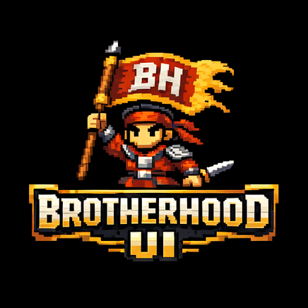
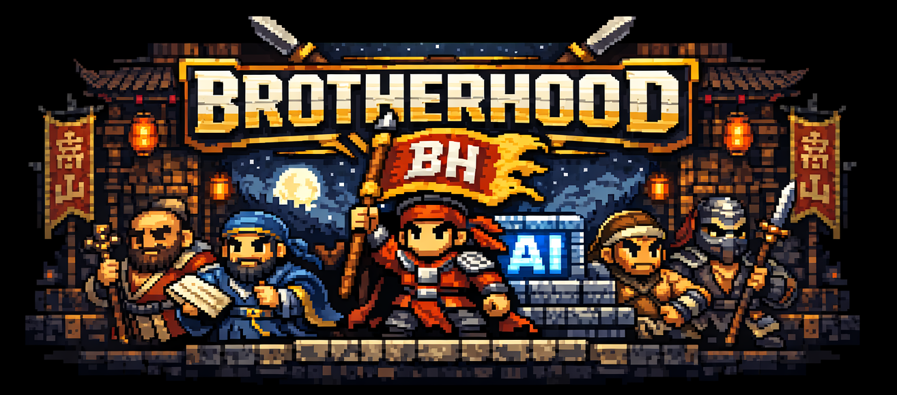
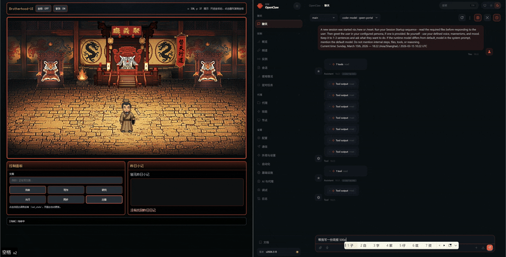
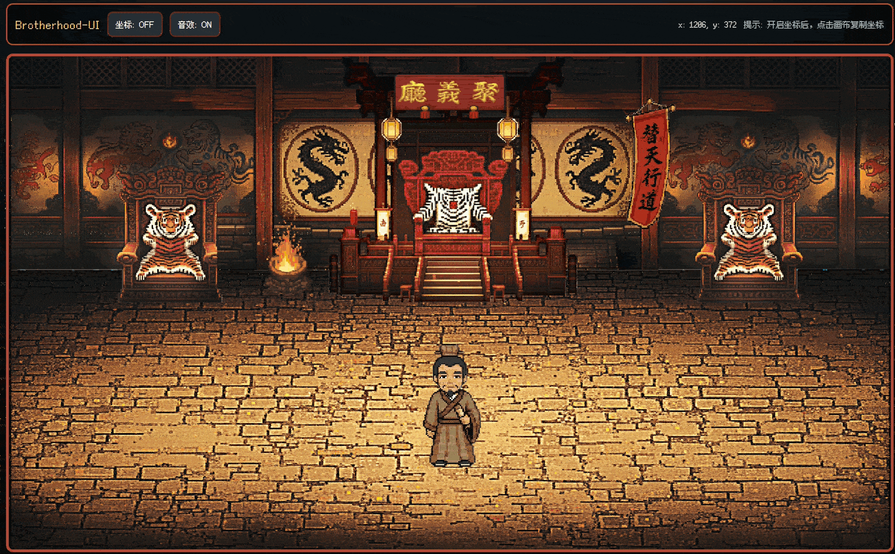
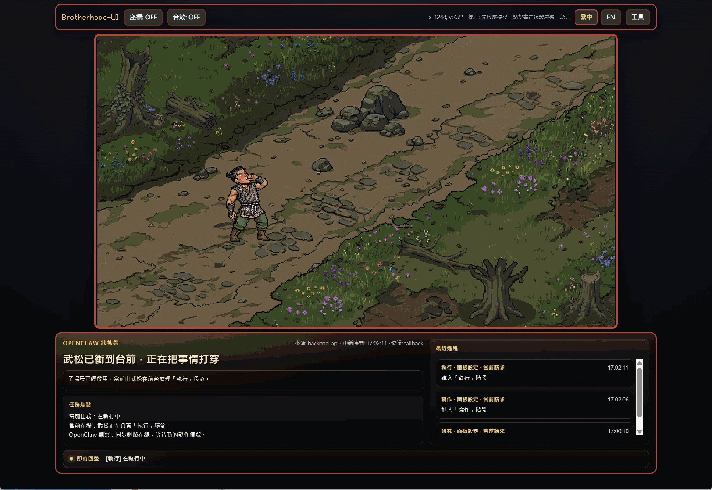

# Brotherhood-UI

<div align="center">
  
  <p><strong>Turn OpenClaw into a live Liangshan stage with a stage-first narrative UI, local auto-sync, and creator-ready tooling.</strong></p>
  <p>
    <a href="https://github.com/haihao0307/Brotherhood-UI"></a>
    <a href="./LICENSE"></a>
    
    
    
    
    
    
  </p>
  
</div>

**Languages:** [English](#english) | [繁體中文](#繁體中文)

---

## English

### What It Is

Brotherhood-UI is a Water Margin-inspired visual runtime for OpenClaw.

It turns an AI workflow into a live Liangshan stage instead of a plain dashboard: one persistent main scene, hero handoffs, child scenes, dialogue, props, music, and a narrative status strip that keeps the current task readable at a glance.

The project started from [ringhyacinth/Star-Office-UI](https://github.com/ringhyacinth/Star-Office-UI), but the current version is no longer a theme swap. It is now a scene-driven workflow board with:

- a stage-first single-screen layout
- local OpenClaw session mirroring
- a single-writer state bus
- bilingual runtime copy
- creator-facing asset sync and acceptance tooling

### Why This Release Stands Out

- **A real stage, not a status toy**
  The main stage stays dominant, while the lower area has been rebuilt into a narrative strip with headline, scene narration, task focus, recent history, and live readout.
- **OpenClaw-aware by default**
  The board can mirror local OpenClaw activity instead of relying only on manual button pushing or direct state edits.
- **Engineered for stable state transitions**
  Current state writes flow through a single-writer event bus and coordinator instead of multiple scripts racing to overwrite `state.json`.
- **Built for creators, not just developers**
  Asset replacement, spritesheet sync, theme updates, docs generation, doctors, and acceptance checks are part of the repo itself.
- **Ready for bilingual presentation**
  `zh-Hant` and `English` switch at runtime for fixed UI, hero naming, and system narration.

### See It In Action

| Main stage runtime | Launcher | Theme sync tool |
| --- | --- | --- |
|  |  |  |

### Compared With the Previous Public Version

Compared with the earlier public iteration of Brotherhood-UI, the current repo is stronger in four visible ways:

- **From concept-first to release-first**
  The older README emphasized the idea, state routing, and manual lifecycle scripts. The current version leads with launcher-driven startup, local sync, creator workflow, and fixed verification entry points.
- **From single-role board to scene runtime**
  The board now combines a persistent main scene, hero-specific child scenes, idle random events, support-hero roaming, and a narrative status strip as one coordinated performance system.
- **From direct state mutation to coordinated state ownership**
  The current version routes events through `state_event_bus.py` and `state_coordinator.py`, making the UI safer against stale writes and script conflicts.
- **From asset sync helper to creator toolchain**
  `sync_agent_theme.py`, `launch_sync_agent_theme_gui.bat`, docs generation, doctors, consistency checks, and acceptance reports now form a usable production workflow.

### Current Release Highlights

- **Single-screen stage-first layout**
  On a common desktop size such as `1600x900`, the top bar, main stage, and narrative strip fit together without default scrolling.
- **Narrative status strip**
  The lower band is a readable status surface, not a transient bubble lane.
- **Persistent main scene plus child-scene handoff**
  Song Jiang and the support cast stay grounded in a persistent stage, while active states can hand off to dedicated subscenes.
- **Support-hero roaming and idle events**
  The board can continue to feel alive when idle instead of freezing as a dead panel.
- **Cross-platform launcher and control runtime**
  Windows and macOS have direct startup paths, and the shared runtime exposes `auto`, `doctor`, `regression`, `asset-check`, and `stop`.
- **Creator workflow for spritesheets and props**
  The repo includes both CLI and GUI entry points for spritesheet building and theme sync.

### Who This Is For

- People who want OpenClaw status to feel theatrical and instantly readable
- Developers who want a local workflow board with stronger state coordination
- Artists and theme creators who need a repeatable asset replacement pipeline

### Current State Mapping

| State | Hero | Meaning |
| --- | --- | --- |
| `idle` | Song Jiang | standby, waiting, or returned from a finished task |
| `researching` | Sun Erniang | reading docs, digging for clues, finding hidden details |
| `writing` | Wu Yong | writing copy, prompts, docs, or structured text |
| `executing` | Wu Song | coding, implementing, running commands, making changes |
| `syncing` | Lin Chong | syncing, integrating, shipping, or handoff |
| `error` | Lu Zhishen | failure, incident, or emergency recovery |

### Architecture In One Line

```text
OpenClaw session / manual event -> state bus -> backend status -> scene runtime -> hero + subscene performance
```

### Quick Start

#### Requirements

- Python 3
- `Flask` from `backend/requirements.txt`
- Node.js only if you want to run frontend regression checks
- A local OpenClaw session if you want automatic session mirroring

#### Windows

Install once:

```powershell
python -m pip install -r backend/requirements.txt
```

Start with the launcher:

```powershell
.\Brotherhood-UI Launcher.bat
```

Direct control runtime:

```powershell
python brotherhood_control_runtime.py auto
python brotherhood_control_runtime.py doctor
python brotherhood_control_runtime.py regression
python brotherhood_control_runtime.py asset-check
python brotherhood_control_runtime.py stop
```

Command wrapper:

```powershell
.\brotherhood-ui.bat auto
```

Default board URL:

```text
http://127.0.0.1:18791
```

#### macOS

Install once:

```bash
python3 -m pip install -r backend/requirements.txt
```

Start the GUI launcher:

```bash
python3 brotherhood_ui_launcher.py
```

Direct control runtime:

```bash
python3 brotherhood_control_runtime.py auto
python3 brotherhood_control_runtime.py doctor
python3 brotherhood_control_runtime.py regression
python3 brotherhood_control_runtime.py asset-check
python3 brotherhood_control_runtime.py stop
```

Command wrapper:

```bash
./brotherhood-ui.sh auto
```

### OpenClaw Integration

The local sync path is:

- [openclaw_session_watch.py](./openclaw_session_watch.py) watches the active local OpenClaw session
- [openclaw_activity_adapter.py](./openclaw_activity_adapter.py) resolves explicit activity hints first, then safe fallback mappings
- [state_event_bus.py](./state_event_bus.py) records incoming events
- [state_coordinator.py](./state_coordinator.py) is the only writer of `state.json`
- [backend/app.py](./backend/app.py) serves the snapshot that drives the frontend

If you want manual lifecycle injection, keep using:

```powershell
python openclaw_bridge.py start "Help me inspect the OpenClaw docs structure"
python openclaw_bridge.py phase "Reading the docs and organizing the plan"
python openclaw_bridge.py done "Task completed"
```

Detailed notes live in [docs/openclaw-integration.md](./docs/openclaw-integration.md).

### Creator Workflow

#### Build or sync spritesheets

Windows GUI shortcut:

```powershell
.\launch_sync_agent_theme_gui.bat
```

Direct GUI:

```powershell
python sync_agent_theme.py --gui
```

Example CLI usage:

```powershell
python sync_agent_theme.py --input .\frames --output .\hero-spritesheet.png
python sync_agent_theme.py --input .\frames --output .\hero-spritesheet.png --theme-json .\frontend\themes\liangshan\theme.json --sync
```

#### Replace assets and validate them

Run the fixed checks:

```powershell
python generate_asset_docs.py
python asset_delivery_doctor.py
type .\docs\asset-status.md
python docs_consistency_doctor.py
python check_theme_consistency.py
python asset_acceptance_check.py
type .\docs\asset-acceptance-report.md
```

Or use the shared acceptance command:

```powershell
python brotherhood_control_runtime.py asset-check
```

Current fixed state-audio names:

```text
state_idle.mp3
state_researching.mp3
state_writing.mp3
state_executing.mp3
state_syncing.mp3
state_error.mp3
```

Folder rules:

- `frontend/themes/liangshan/props/main/`
  main-scene props only
- `frontend/themes/liangshan/subscenes/<scene>/bg.png`
  child-scene background
- `frontend/themes/liangshan/subscenes/<scene>/props/`
  props for that child scene only

References:

- [docs/asset-workflow.md](./docs/asset-workflow.md)
- `docs/asset-status.md` (generated)
- `docs/asset-acceptance-report.md` (generated)
- [frontend/themes/liangshan/PLACE_ASSETS_HERE.txt](./frontend/themes/liangshan/PLACE_ASSETS_HERE.txt)
- [frontend/themes/liangshan/audio/PLACE_AUDIO_HERE.txt](./frontend/themes/liangshan/audio/PLACE_AUDIO_HERE.txt)
- [frontend/themes/liangshan/asset-manifest.json](./frontend/themes/liangshan/asset-manifest.json)

### Verification

The repo now has three fixed verification layers:

1. asset and docs checks
2. theme and semantic consistency checks
3. frontend behavior regression

Run the frontend regression directly:

```powershell
python brotherhood_control_runtime.py regression
```

It verifies:

- `idle -> handoff -> child scene -> idle`
- Song Jiang seeded first idle random event
- support hero roaming unlock
- handoff selects the hero at the current roaming position
- idle random events are interrupted cleanly by a new task

### Repository Structure

```text
Brotherhood-UI/
  backend/
  docs/
    asset-workflow.md
    developer-current-version-guide.md
    openclaw-integration.md
    task-routing-rules.md
    media/
  frontend/
    js/
    themes/
      liangshan/
        asset-manifest.json
        theme.json
        theme-dialogues.json
        theme-main-scene-events.json
        props/
          main/
        subscenes/
        audio/
  asset_acceptance_check.py
  asset_delivery_doctor.py
  brotherhood_control_runtime.py
  brotherhood_ui_launcher.py
  Brotherhood-UI Launcher.bat
  brotherhood-ui.bat
  brotherhood-ui.sh
  check_theme_consistency.py
  docs_consistency_doctor.py
  frontend_regression_check.js
  generate_asset_docs.py
  launch_sync_agent_theme_gui.bat
  openclaw_activity_adapter.py
  openclaw_bridge.py
  openclaw_session_watch.py
  openclaw_sync_doctor.py
  route_task.py
  set_state.py
  state_bus_doctor.py
  state_coordinator.py
  state_event_bus.py
  sync_agent_theme.py
  task_board.py
```

### Why This Version Is Different

- The board is no longer a single-character status toy
- `researching` is now owned by **Sun Erniang**
- Main scene, child scenes, idle random events, roaming, and narrative strip now work as one runtime
- State writes are coordinated through a single bus instead of many scripts racing to overwrite state
- Asset replacement now includes sync tooling, generated docs, doctors, and acceptance reports

### Roadmap

- stronger OpenClaw protocol integration
- richer art replacement over placeholders
- better creator-facing asset tooling
- more behavior regression coverage
- more polished main-scene and child-scene performance

### License

Apache 2.0. See [LICENSE](./LICENSE).

---

## 繁體中文

### 這個專案是什麼

Brotherhood-UI 是一個把 OpenClaw 工作流程轉成「梁山現場演出」的前端可視化執行時。

它不是普通狀態看板，而是把 AI 任務過程轉成一個以舞台為中心的即時敘事 UI：固定主場景、英雄交棒、子場景、道具、對白、音樂，以及可持續閱讀的敘事狀態帶，都在同一套運行時裡協同工作。

專案最早源於 [ringhyacinth/Star-Office-UI](https://github.com/ringhyacinth/Star-Office-UI)，但目前版本已經不是換皮，而是具備本機 OpenClaw 同步、單寫入狀態總線、雙語 UI、素材同步與驗收工具鏈的完整梁山工作流舞台。

### 這次版本最值得突出的地方

- **這是一個真正的舞台，不是狀態玩具**
  主舞台保持第一視覺焦點，下半部則改成真正可閱讀的敘事狀態帶。
- **預設就能感知 OpenClaw**
  除了手動腳本，現在也能鏡像本機 OpenClaw 會話活動。
- **狀態流更穩**
  目前所有最終狀態都經過 `state_event_bus.py` 與 `state_coordinator.py`，不再讓多個腳本互搶 `state.json`。
- **創作者工作流已經成形**
  spritesheet GUI、主題同步、資產說明生成、doctor、consistency、acceptance 都已內建。
- **適合對外展示**
  `繁體中文` / `English` 可即時切換，固定 UI 與系統敘事會一起切換。

### 演示

| 主舞台 | Launcher | 主題同步工具 |
| --- | --- | --- |
|  |  |  |

### 相比早期公開版本，現在最重要的差異

- **從概念展示走到可發布形態**
  舊版 README 更偏重概念、路由與手動生命週期；目前版本把啟動入口、本機同步、創作者工作流與固定驗證鏈都前置了。
- **從角色看板走到場景執行時**
  現在已經有主場景、子場景、idle 隨機事件、support hero roaming 與敘事狀態帶。
- **從直接改狀態走到單寫入仲裁**
  狀態寫入現在先進事件總線，再由協調器產出最終快照。
- **從單一同步腳本走到素材工具鏈**
  `sync_agent_theme.py`、`launch_sync_agent_theme_gui.bat`、文件生成、doctor、consistency、acceptance 現在已經是完整流程。

### 目前版本亮點

- **單屏舞台優先版面**
  像 `1600x900` 這類常見桌面尺寸，頂欄、主舞台、敘事狀態帶可同屏。
- **敘事狀態帶**
  包含主標題、舞台解說、任務焦點、最近過程與即時回聲。
- **常駐主場景 + 子場景交棒**
  宋江與 support cast 穩定駐留主舞台，工作狀態再切進對應子場景。
- **idle 隨機事件與 roaming**
  閒置時畫面仍然是活的，不是停住的空板。
- **跨平台啟動入口**
  Windows / macOS 都有直接可用的啟動方式與共用控制執行時。
- **素材同步與道具工作流**
  目前同時提供 CLI 與 GUI 的 spritesheet / theme sync 工具。

### 適合誰使用

- 想把 OpenClaw 工作狀態轉成更有戲劇感、更容易一眼看懂的人
- 想要本機工作流看板，但又不想忍受狀態互相覆蓋的開發者
- 需要可重複素材替換流程的美術與主題製作者

### 目前狀態對應

| 狀態 | 英雄 | 含義 |
| --- | --- | --- |
| `idle` | 宋江 | 待命、等待、任務完成後回堂前 |
| `researching` | 孫二娘 | 查資料、翻細節、摸線索 |
| `writing` | 吳用 | 寫文案、寫提示詞、整理說明、整理文件 |
| `executing` | 武松 | 改程式、做頁面、跑命令、真正落地 |
| `syncing` | 林沖 | 同步、整合、交付、流轉 |
| `error` | 魯智深 | 報錯、失敗、事故、緊急救火 |

### 一句話架構

```text
OpenClaw 會話 / 手動事件 -> 狀態總線 -> 後端狀態快照 -> 場景執行時 -> 英雄與子場景演出
```

### 快速開始

#### 需求

- Python 3
- `backend/requirements.txt` 內的 `Flask`
- 若要跑前端回歸，需要 Node.js
- 若要自動同步，需要本機 OpenClaw 會話

#### Windows

先安裝一次依賴：

```powershell
python -m pip install -r backend/requirements.txt
```

用 Launcher 啟動：

```powershell
.\Brotherhood-UI Launcher.bat
```

直接使用共用控制執行時：

```powershell
python brotherhood_control_runtime.py auto
python brotherhood_control_runtime.py doctor
python brotherhood_control_runtime.py regression
python brotherhood_control_runtime.py asset-check
python brotherhood_control_runtime.py stop
```

也可以走命令包裝器：

```powershell
.\brotherhood-ui.bat auto
```

預設面板網址：

```text
http://127.0.0.1:18791
```

#### macOS

先安裝一次依賴：

```bash
python3 -m pip install -r backend/requirements.txt
```

啟動 GUI launcher：

```bash
python3 brotherhood_ui_launcher.py
```

直接使用共用控制執行時：

```bash
python3 brotherhood_control_runtime.py auto
python3 brotherhood_control_runtime.py doctor
python3 brotherhood_control_runtime.py regression
python3 brotherhood_control_runtime.py asset-check
python3 brotherhood_control_runtime.py stop
```

也可以走命令包裝器：

```bash
./brotherhood-ui.sh auto
```

### OpenClaw 自動同步

目前本機同步鏈路是：

- [openclaw_session_watch.py](./openclaw_session_watch.py) 監看當前 OpenClaw 會話
- [openclaw_activity_adapter.py](./openclaw_activity_adapter.py) 優先解析顯式活動提示，再回退到安全映射
- [state_event_bus.py](./state_event_bus.py) 記錄事件
- [state_coordinator.py](./state_coordinator.py) 作為唯一 `state.json` 寫入者
- [backend/app.py](./backend/app.py) 把最終快照提供給前端

如果你要手動注入生命週期，也可以繼續用：

```powershell
python openclaw_bridge.py start "幫我查一下 OpenClaw 文件結構"
python openclaw_bridge.py phase "正在讀文件並整理方案"
python openclaw_bridge.py done "任務完成"
```

詳細說明見 [docs/openclaw-integration.md](./docs/openclaw-integration.md)。

### 創作者工作流

#### 建 spritesheet / 同步主題

Windows GUI 快捷入口：

```powershell
.\launch_sync_agent_theme_gui.bat
```

直接啟動 GUI：

```powershell
python sync_agent_theme.py --gui
```

CLI 範例：

```powershell
python sync_agent_theme.py --input .\frames --output .\hero-spritesheet.png
python sync_agent_theme.py --input .\frames --output .\hero-spritesheet.png --theme-json .\frontend\themes\liangshan\theme.json --sync
```

#### 替換素材後跑固定驗收

```powershell
python generate_asset_docs.py
python asset_delivery_doctor.py
type .\docs\asset-status.md
python docs_consistency_doctor.py
python check_theme_consistency.py
python asset_acceptance_check.py
type .\docs\asset-acceptance-report.md
```

或直接用共用驗收命令：

```powershell
python brotherhood_control_runtime.py asset-check
```

目前固定的狀態音檔命名：

```text
state_idle.mp3
state_researching.mp3
state_writing.mp3
state_executing.mp3
state_syncing.mp3
state_error.mp3
```

目錄規則：

- `frontend/themes/liangshan/props/main/`
  主場景道具
- `frontend/themes/liangshan/subscenes/<scene>/bg.png`
  子場景背景
- `frontend/themes/liangshan/subscenes/<scene>/props/`
  該子場景專屬道具

參考文件：

- [docs/asset-workflow.md](./docs/asset-workflow.md)
- `docs/asset-status.md`（生成檔）
- `docs/asset-acceptance-report.md`（生成檔）
- [frontend/themes/liangshan/PLACE_ASSETS_HERE.txt](./frontend/themes/liangshan/PLACE_ASSETS_HERE.txt)
- [frontend/themes/liangshan/audio/PLACE_AUDIO_HERE.txt](./frontend/themes/liangshan/audio/PLACE_AUDIO_HERE.txt)
- [frontend/themes/liangshan/asset-manifest.json](./frontend/themes/liangshan/asset-manifest.json)

### 內建驗證鏈

目前已固定成三層：

1. 素材與文件檢查
2. 主題與語義一致性檢查
3. 前端行為回歸測試

直接跑前端回歸：

```powershell
python brotherhood_control_runtime.py regression
```

它會驗證：

- `idle -> handoff -> child scene -> idle`
- 宋江第一條 idle 隨機短事件
- support hero roaming 解鎖
- handoff 時保留 support hero 當前站位
- idle 隨機短事件被新任務乾淨打斷

### 倉庫結構

```text
Brotherhood-UI/
  backend/
  docs/
    asset-workflow.md
    developer-current-version-guide.md
    openclaw-integration.md
    task-routing-rules.md
    media/
  frontend/
    js/
    themes/
      liangshan/
        asset-manifest.json
        theme.json
        theme-dialogues.json
        theme-main-scene-events.json
        props/
          main/
        subscenes/
        audio/
  asset_acceptance_check.py
  asset_delivery_doctor.py
  brotherhood_control_runtime.py
  brotherhood_ui_launcher.py
  Brotherhood-UI Launcher.bat
  brotherhood-ui.bat
  brotherhood-ui.sh
  check_theme_consistency.py
  docs_consistency_doctor.py
  frontend_regression_check.js
  generate_asset_docs.py
  launch_sync_agent_theme_gui.bat
  openclaw_activity_adapter.py
  openclaw_bridge.py
  openclaw_session_watch.py
  openclaw_sync_doctor.py
  route_task.py
  set_state.py
  state_bus_doctor.py
  state_coordinator.py
  state_event_bus.py
  sync_agent_theme.py
  task_board.py
```

### 這個版本和以前最不同的地方

- 已經不是單角色狀態看板
- `researching` 已正式交給 **孫二娘**
- 主場景、子場景、idle 隨機事件、roaming、敘事狀態帶已經整合成同一套 runtime
- 狀態層改成單寫入總線，不再多腳本互搶 `state.json`
- 素材替換已搭配 GUI/CLI sync、生成文件、doctor、consistency 與 acceptance

### 後續方向

- 更穩定的 OpenClaw 協議層整合
- 更多 placeholder 被正式素材替換
- 更適合創作者的素材工具
- 更完整的行為回歸覆蓋
- 更細膩的主場景與子場景 polish

### 授權

Apache 2.0，見 [LICENSE](./LICENSE)。
